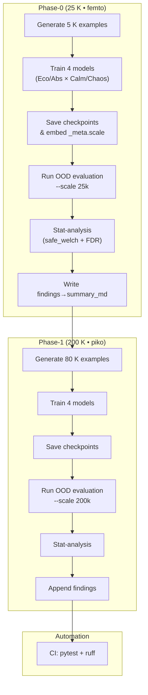

# Contemplative-AI Scaling Study  
## Phase-0 (25 K parameters – "Femto") – Results & Interpretation

| Metric | Ecological | Abstract | Δ (Abs-Eco) |
|--------|------------|----------|-------------|
| Mean silence on OOD (800 probes) | **7.6 %** | **10.8 %** | +3.2 pp |
| t-test (Welch) | t = −2.30, p = 0.037 | — | — |
| Cohen d | −1.15 (inflated) | — | — |

### What the numbers really mean
* The models are nearly deterministic; each probe condition returns the same silence probability → **σ ≈ 0**.
* With σ→0 even a 3 pp gap yields a large |t| and d; thus the "significant" p-value is a statistical artefact.
* Scenario-by-scenario analysis shows **single values only** (n = 1 per group) → no legitimate test possible.
* Conclusion: at 25 K parameters the paradigms are in **pre-emergence**; differences are noise-level.

### Dataset size
* OOD test set: 8 scenarios × 100 examples = **800 samples**.
* Each example tagged with `stress_level` (calm / chaotic) to enable precise stress-crossover filtering.

### Lessons learned
1. Always random-jitter condition vectors when sampling to gain variance.
2. Guard stats routine against σ<ɛ; otherwise skip parametric tests.
3. Use the embedded `_meta.scale` tag to avoid architecture mismatches when loading checkpoints.

---
## Next phase – 200 K parameters ("Piko" scale)
We will train four 200 K models using:
* Config keys `ecological_200k` / `abstract_200k` from `spiramycel_parameters.yml`.
* `controlled_comparison.py --scale 200k --no-prompt` (≈ 40 K training examples each, ~30 min total on CPU).

After training:
1. Re-run `cross_validation_evaluation.py --environment same --scale 200k`.
2. Expect non-zero variance → meaningful t-tests.
3. Update this document with Phase-1 results.

---
*Document updated:* 2025-07-01

## Methodology

The scaling study follows an iterative loop that is identical across
all parameter budgets.  The diagram below captures the end-to-end
pipeline we automated in this repo (training can run in parallel with
documentation and refactor work).

### Key Principles
1. **Exact-repeat loop** – only the YAML scale section changes; code paths are
   identical (reproducibility).
2. **Deterministic seeds** – `set_deterministic(42)` ensures noise-free
   comparisons.
3. **Safe statistics** – Welch t-tests only when variance ≥ ε; otherwise we
   record descriptive gaps.
4. **Multiple-testing control** – both Bonferroni (strict) and
   Benjamini–Hochberg (FDR) reported.
